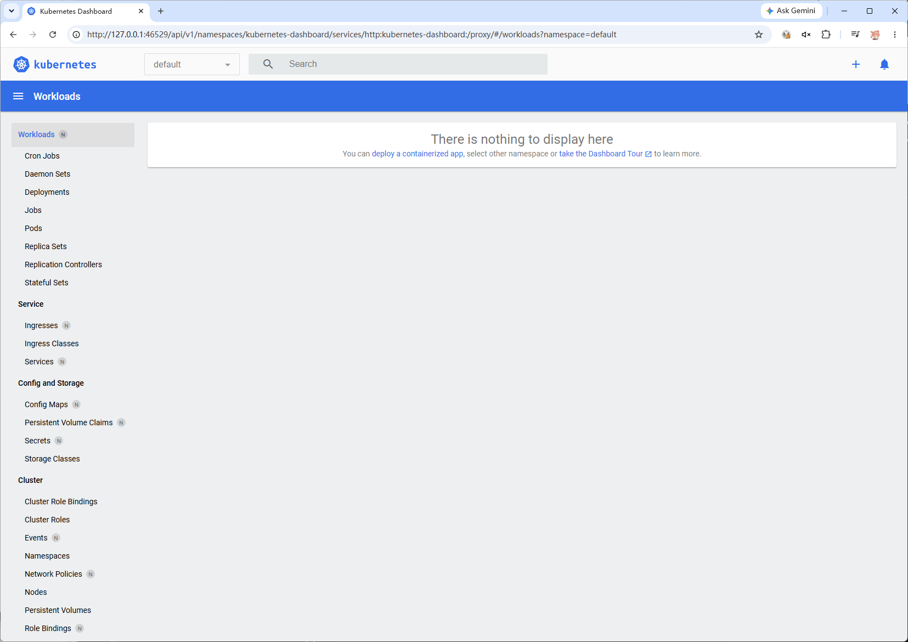

Kubernetes是一种实现分布式架构的框架，本文将展示如何在单台主机上运行分布式架构的项目用于调试，并最终打包便于部署。
<!--more-->

# 安装Kubernetes
Kubernetes的本质是可以自动管理Docker的引擎，单机运行时，我们选择minikube作为集群管理的工具，模拟多机部署的情况

首先安装Docker、minikube和kubectl
```shell
sudo pacman -S docker minikube kubectl
```

minikube不允许使用root启动，将用户添加为Docker组，就可以不用root管理Docker了
```shell
sudo groupadd docker
sudo usermod -aG docker echo
newgrp docker
```

运行Docker和minikube，启动管理界面
```shell
sudo systemctl start
minikube start --container-runtime containerd
minikube dashboard
```



# Docker镜像
接下来我们需要编译Docker镜像，Dockerfile一般都有模板可以参考，比如[pnpm](https://pnpm.io/docker)和[Spring Boot](https://spring.io/guides/gs/spring-boot-docker)。

使用BuildKit编译并试运行
```shell
sudo pacman -S docker-buildx
docker buildx build -t <tag> .
docker run -d -p 127.0.0.1:3000:3000 <tag>:latest
```

其中第一个3000是需要被暴露的端口号，第二个3000是映射的端口号。

查看运行状态和日志
```shell
$ docker ps
CONTAINER ID   IMAGE                      COMMAND                  CREATED              STATUS              PORTS                      NAMES
93d1f16b7513   <tag>:latest   "docker-entrypoint.s…"   About a minute ago   Up About a minute   127.0.0.1:3000->3000/tcp   sharp_ishizaka

$ docker logs sharp_ishizaka

> note-fe@0.1.0 start /app
> cross-env PROFILE=prod next start

- ready started server on 0.0.0.0:3000, url: http://localhost:3000
- info Loaded env from /app/.env
```

sharp_ishizaka是Docker随机分配的名字

然后使用GitHub Actions，将Docker镜像[自动编译并托管到GitHub上](https://github.com/marketplace/actions/build-and-push-docker-images)

# 部署
接下来通过GitHub托管的Docker镜像，然后部署到Kubernetes上
```shell
kubectl create deployment <deployment-name> --image=ghcr.io/<owner>/<repo>:<version-tag>
```

查看状态
```shell
kubectl get pods                        NAME                             READY   STATUS    RESTARTS   AGE
<deployment-name>-56dd4ffd7-tbbds   1/1     Running   0          2s
```

临时测试可以使用port-forward来端口转发，如果需要持久化，可以用expose来创建service
```shell
$ kubectl port-forward <deployment-name>-56dd4ffd7-tbbds 3000:3000
Forwarding from 127.0.0.1:3000 -> 3000
Forwarding from [::1]:3000 -> 3000
```

# 参考
Kubernetes上的文档十分完整，只是编排上不太便于快速阅读，以下几篇文章能更快找到思路：
- [docker/buildx: Docker CLI plugin for extended build capabilities with BuildKit](https://github.com/docker/buildx#getting-started)
- [Hello Minikube | Kubernetes](https://kubernetes.io/docs/tutorials/hello-minikube/)
- [Using kubectl to Create a Deployment | Kubernetes](https://kubernetes.io/docs/tutorials/kubernetes-basics/deploy-app/deploy-intro/)

下一篇文章将讲解如何创建Helm Chart，使用包管理来方便地进行部署。

（未完待续……）
